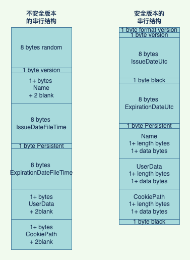
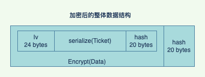

## FormsAuthentication for Java


### 基于 Spring Boot Starter 的快速使用

[](https://maven-badges.herokuapp.com/maven-central/org.guohai/fa4j-spring-boot-starter/)


1. 在 Spring Boot 项目中加入 fa4j-spring-boot-starter 依赖

    ```Maven```
    ~~~ xml
    <dependency>
      <groupId>org.guohai</groupId>
      <artifactId>fa4j-spring-boot-starter</artifactId>
      <version>0.8.2</version>
    </dependency>
    ~~~

2. 添加配置

   ``` xml
   gh.fa.validation-key = 
   gh.fa.decryption-key= 
   gh.fa.validation = 
   gh.fa.decryption = 
   gh.fa.use-legacy-forms-authentication-ticket-compatibility = false
   ```
   
3. 在项目中进行加密/解密

   ~~~ java
   @Autowired
   FormsAuthentication formsAuthentication;
   // 加密后的值直接写cookies即可
   String cookieAuth = formsAuthentication.encrypt(ticket);
   
   // 从cookies加载过来的串进行解密
   FormsAuthenticationTicket ticket = formsAuthentication.decrypt(cookieAuth);
   ~~~

### fa4j-core 的使用

[](https://maven-badges.herokuapp.com/maven-central/org.guohai/fa4j-core/)

1. 在 Java 项目中加入 fa4j-core 的依赖
   ~~~ xml
   <dependency>
     <groupId>org.guohai</groupId>
     <artifactId>fa4j-core</artifactId>
     <version>0.8.2</version>
   </dependency>
   ~~~

2. 在项目中使用

   ~~~ java
   // 通过 validateiionKey 创建hash对象，对数据进行hash校验
   HashProvider hashProvider = new HashProvider(validationKey);
   // 通过 encryptKey 对数据进行加密，目前支持 aes\des\3des三种算法
   MachineKeySection machineKeySection = new MachineKeySection(encryptKey, DecryptionEnum.AES);
   // 通过上述参数来初始化 FormsAuthentication 类。并确认对象序列化的兼容性，true 兼容.net 2.0以前。false 兼容2.0sp2 ~ 4.8
   FormsAuthentication formsAuthentication = new FormsAuthentication(machineKeySection, hashProvider, true);
   // 对ticket进行加密
   String cookieAuth = formsAuthentication.encrypt(ticket);
   
   // 解密数据
   FormsAuthenticationTicket newTicket = formsAuthentication.decrypt(cookieAuth);
   ~~~
   

### 工作原理

FormsAuthentication 是微软在 .Net 2.0时的产物一直持续到.net 4.8 之后 的.net core和现在的.net 6都不再集成该方法，主要做用是在分布式系统中加密用户标识并存储进cookies中使用。非常绘力的是我们公司的.net项目就使用了该功能。在进行站点集群 java 迁移的时候肯定还要考虑兼容性问题。

首先感谢微软开源了 [.NET Framework 4.8的代码](https://referencesource.microsoft.com/)让我们有可能知道内部的实现方案。

整个加密过程先做的是Ticket的串行化。分为2.0和4.0以及打了sp补丁后的两种串行化方案。先上对比图



1. 其中源码中标记为不安全的使用的是操作系统携带的 webengine.dll 中的 CookieAuthConstructTicket 方法。在网上能搜到这个dll的实现源码是个[CPP代码](https://github.com/selfrender/Windows-Server-2003/blob/5c6fe3db626b63a384230a1aa6b92ac416b0765f/com/netfx/src/framework/xsp/isapi/securityapi.cxx)，怀疑可以通过传输特定的 userdata 造成内存泄漏
2. 第二种方案被标记为安全的串行化，直接使用的.net自带的程序实现了序列化。
3. 要注意在旧版本中的时间使用的是FileTime，这是一个从1601年1月1日为原点的100纳秒为单位的计时方案。新版本中的日期时间使用的是 Ticks，这是一个从0001年1月1日为原点100纳秒为单位的计时方案。
4. 程序中的long转byte都是使用的小端存储，与java中的默认大端不一样需要手工转存。

之后就是套填充，做hash。看一下最终的数据结构



